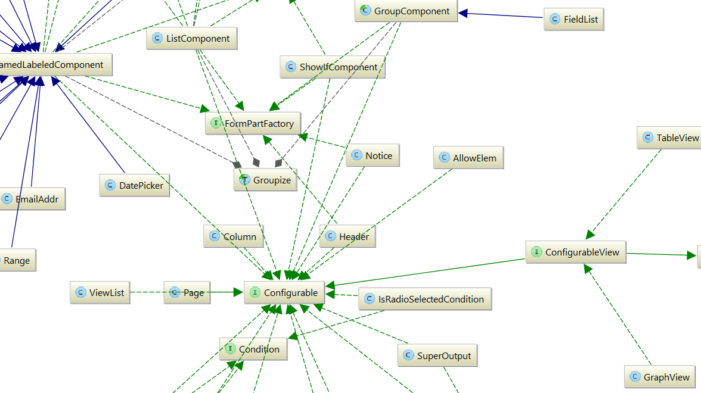
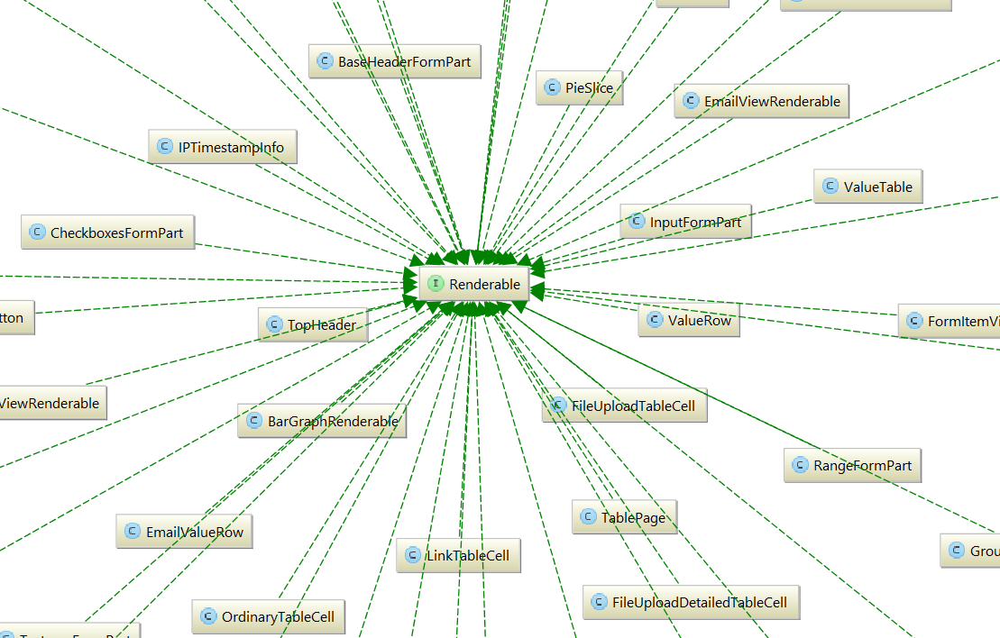
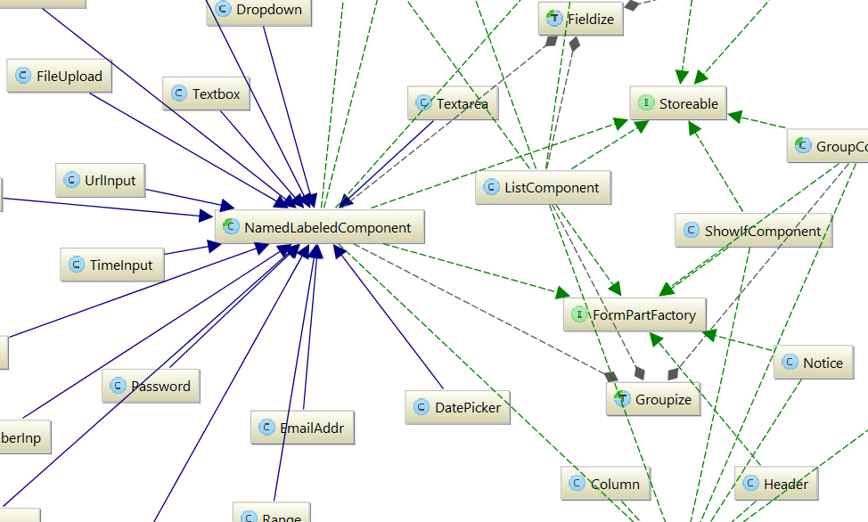
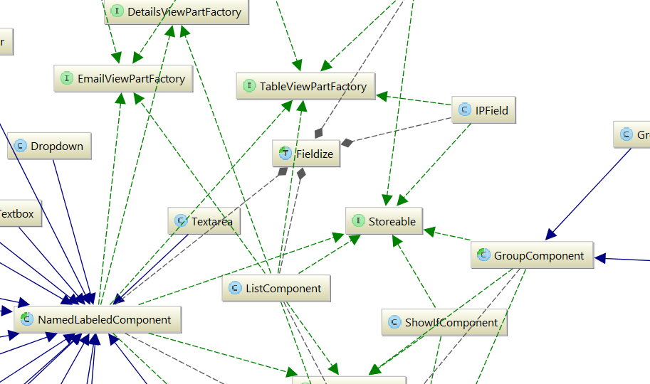

Four interfaces are particularly important parts of Formulaic: Configurable, Renderable, FormPartFactory, and Storeable. This page will focus on these four interfaces as a general way of introducing the codebase.

All class diagrams shown here were generated using PHPStorm; they may not be entirely up-to-date, but should be close.

## Configurable

The Configurable interface specifies that a particular class corresponds to an element within a configuration file, and that each instance of the class corresponds to exactly one usage of the element. So, for instance, the Textbox class is Configurable because it corresponds to the "textbox" element.

Which element corresponds to which class is determined by the `elementMap` given in `include/Parser.php`. To add a new configuration file element, one can just add to this map. The meaning of an element never depends on context, inasmuch as each element is associated with exactly one class.

When an element is encountered in the configuration file, the corresponding class is instantiated (via `__construct`) with an associative array containing the attributes, text, and child elements associated with the element in the configuration file.

## Renderable

The Renderable interface specifies that a particular class can create HTML via a `render()` method. In particular, this method will generally use the `HTMLGenerator` DSL specified in `include/HTMLGenerator.php`.

One of the rules to which Formulaic adheres is that **no Configurable classes are Renderable.** This is crucial because it allows for a much greater separation of concerns.

## FormPartFactory

As stated above, no Configurable classes are Renderable. But many Configurable classes, such as "textbox," do have associated HTML content &ndash; most importantly, the HTML that is placed inside of a web form. So how are Configurables and Renderables connected?

The answer is that many Configurables also implement FormPartFactory, and therefore have a `makeFormPart` method. This method, which returns a Renderable, provides the HTML that should be placed into a form. In the case of the `textbox` element, this includes a `<input type="text">` tag.

## Storeable

Besides having associated HTML, many parts of a configuration file &ndash; such as Textboxes &ndash; have associated data which are included as part of a form submission. In the case of `textbox`, this means the text which the user entered into the textbox.

Furthermore, things like Textboxes aren't always associated with submitted data; instead, they can be associated with validation errors &ndash; errors in a form submission that the user will need to correct (such as a missing value for a `required` form field).

Such classes implement the `Storeable` interface, whose sole method, `getSubmissionPart`, gets the part of the form submission (whether an error or a successful value) associated with a form control. In particular, this uses `Result` types; for more, see `include/Result.php`.